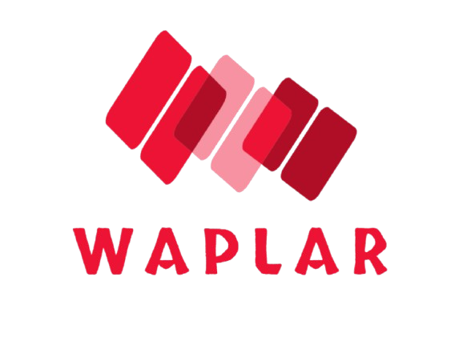

# 语言

- **中文**
- [English](README.md)

## 介绍

Waplar Framework 是一个依赖于 laravel 的开发框架，它在 laravel 之上提供了更多的组件来帮助你构建复杂的应用程序。

## 官方文档

暂未提供，正在编写。

## Alpha 版本体验

参阅[安装](ALPHA-INSTALLATION-zh.md)指南。

## 贡献

感谢您对 Waplar Framework 的贡献。

## 行为准则

为确保社区内和谐，请查阅并遵守[行为准则](.github/CODE_OF_CONDUCT.md)。

## 安全漏洞

请查看[我们的安全政策](SECURITY.md)，了解如何报告安全漏洞。

## 许可证

Waplar Framework 是一款基于[MIT许可证]（LICENSE .md）的开源软件。

